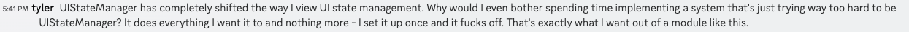

## UIStateManager 1.0.0

> Created with a healthy dose of passion and a sprinkle of caffeine by Larry, the coding aficionado, during the magical hours of 4 AM on a whimsical Saturday morning. In a caffeine-fueled state of brilliance, Larry embarked on an adventure of code and creativity to bring forth this remarkable creation.    
Enter the extraordinary realm of the `UIStateManager` module! This enchanting tool empowers you to effortlessly manage UI states in your Roblox games. Seamlessly hide and reveal UI components, and even wield the power to transform CoreGui elements with a mere flick of your code wand.    
Embark on an epic journey as you embrace the magic within. Let this wondrous creation be your guide as you unlock the potential of your UI in delightful and imaginative ways.    
Take a leap of faith and trust in the artistry of Larry's creation. Your UI sorcery awaits!

 

`UIStateManager` is a powerful and easy-to-use Roblox module to handle UI Visibility. It provides functionality for managing different UI states, including hiding and showing UI components and making changes to CoreGui elements.

## Installation

Wally (recommended):
1. Add uistatemanager as a dependency in your wally.toml file. (e.g. `UIStateManager = "mada-r/uistatemanager@^1"`)
2. Install uistatemanager with `wally install`.

#### Key Features:

- Allows you to define and register UI states, each with its own set of properties and configurations.
- Provides methods for setting the UI state to a specific state, hiding/showing components based on the state configuration, and making changes to CoreGui elements.
- Supports the registration of UI components, which can be used in the configuration of UI states to show or hide specific components as needed.
- Offers event hooks that allow you to register custom callback functions to be executed when specific events occur, such as state changes or CoreGui changes.

## Functions
### `SetState(state: string, forceState: boolean?): (boolean, string?)` 
Set the UI state to the desired state.

- `state` (string): The name of the state to set.  
- `forceState` (boolean, optional): Determines whether to force the state change even if the current state blocks it.

 
Returns a tuple:

- `success` (boolean): Indicates whether the state was set or blocked. Returns true if the state was set successfully, and false if it was blocked.

- `reason` (string, optional): Provides the reason as to why the state was blocked, if applicable.
This function sets the UI state to the specified state and performs associated operations, such as hiding/showing components based on the configuration of that state. If the specified state does not exist, a warning is issued, and no state change occurs. If the state configuration includes CoreGui changes, the corresponding CoreGui components are shown/hidden accordingly.

### `RegisterState(name: string, properties: StateProperties)` 
Register a new UI state with the specified name and properties.

`name` (string): The name of the UI state to register.
properties (StateProperties): The properties and configuration for the UI state.
This function registers a new UI state with the given name and properties. If a UI state with the same name already exists, a warning is issued, and the registration is skipped. The UI state properties define the configuration for the state, including the components to hide/show and any CoreGui changes.

### `RegisterComponent(name: string, class: {})` 
Register a new UI component with the specified name and class.

- `name` (string): The name of the UI component to register. 
- `class` ({}): The class representing the UI component.  
This function registers a new UI component with the given name and class. If a UI component with the same name already exists, a warning is issued, and the registration is skipped. The UI component class represents the behavior and functionality of the component. The class should include the methods Hide() and Show() to control the visibility of the component. Once registered, the UI component can be used in the configuration of UI states to show or hide the component as needed. 

 

### `GetState(): string` 
Returns the current UI state.

This function returns the current UI state as a string. If there is no current state, it returns nil.

 

### `PreviousState(): (string|nil)`  
Revert to the previous UI state.
This function reverts the UI state to the previous state if available. It checks if a previous state exists and calls the SetState function with the previous state as the parameter.
- state (string) - name of current state

 

### `SetDefault(): (boolean, string?)`  
Set the state to the default state.

Returns a tuple:

- `success` (boolean): Indicates whether the default state was set successfully.
- `reason` (string, optional): Provides the reason why the default state could not be set, if applicable.
Checks if a default state is registered and sets the current state to it. If there is no default state registered, it returns nil and a failure reason.

 

### `RegisterDefaultState(name: string): (boolean, string?)`
Registers a default state for the SetDefault() method.

- `name` (string): The name of the default UI state.

 
Returns a tuple:

 

- `success` (boolean): Indicates whether the default state was registered successfully.
- `reason` (string, optional): Provides the reason why the default state could not be registered, if applicable.
This function registers a default state to be used with the SetDefault() method. If the specified state does not exist, it returns nil and a failure reason.

### `RegisterEventHook(eventName: string, callback: (newState: string, oldState: string) -> ())`
Registers an event hook to listen for specific events triggered by the UIStateManager and execute custom callback functions in response.

`eventName` (string): The name of the event hook.
`callback` (function): The callback function to be executed when the event occurs. It should accept two string parameters representing the new state and old state associated with the event.
This function allows you to register an event hook to listen for specific events triggered by the UIStateManager. The event hook can be used to execute custom logic or trigger additional actions in response to the events.

 

## Types
### StateProperties
A table representing the properties and configuration for a UI state.

`Hides` (table, optional): An array of component names to hide when the state is active. Use * to hide all components.
`Shows` (table, optional): An array of component names to show when the state is active. Use * to show all components.
`CoreGui` (table, optional): An object representing changes to CoreGui components.
- `Shows` (table, optional): An array of CoreGui component names to show when the state is active. Use * to show all `CoreGui` components.
- `Hides` (table, optional): An array of CoreGui component names to hide when the state is active. Use * to hide all `CoreGui` components.